# Networking Lab · Sequential HTTP Mini Web Application

## 1. Project title and description

**Networking Lab · Part 2 — From a Minimal HTTP Server to a Web Application on AWS.**

This project extends a minimal, socket-based Java HTTP server (`ServerSocket` / `Socket`, no
framework) into a small but complete web application: it serves an HTML page, a JavaScript
client, and images as static resources, and it exposes four hardcoded JSON services (greeting,
square, server time, health). The browser talks to it asynchronously, so the page never reloads,
but the server itself remains strictly **sequential** — it accepts and fully handles one
connection before accepting the next.

The problem this lab addresses is scalability *literacy*, not scalability itself: before
introducing threads, pools, or load balancers, you need to see — concretely, with your own
server — what "one request at a time" actually means, and how a single HTML page quietly turns
into several independent HTTP requests (document, script, images, JSON calls). Concurrency and
distribution are explicitly out of scope here; they are the next architectural step, taken only
after this baseline's limits are visible and understood.

Deployment of the packaged artifact onto AWS EC2 was performed by the author, following the
provisioning and cleanup steps described in Section 10 of this README; it is not something this
codebase automates, and it is not part of the source tree.

## 2. System metaphor and architecture

**System metaphor: a post office with a single clerk and one service window.**

Picture a small post office. There is exactly one clerk (**the Java server**) and one service
window (**the listening socket**, bound to one TCP port). Customers (**browsers**) walk up one at
a time. The clerk always finishes the current customer completely — hands over every stamp,
package, and receipt — before calling the next person in line. The clerk never serves two
customers "at once"; that would require a second clerk, which this post office deliberately does
not have yet.

When a customer walks in asking for "the standard package" (**a GET request for `/`**), the clerk
hands over a folder containing a form (**`index.html`**), a small pre-printed instruction sheet
(**`app.js`**) and a couple of sample photos (**the images**). The customer reads the instructions
right there at the counter and, without getting back in line to talk to the clerk again in
person, uses a **pre-addressed request slip system** (JavaScript's `fetch`) to slide follow-up
requests through a mail slot (an **asynchronous HTTP call**) — asking for a greeting, a squared
number, or the current time on the wall clock behind the counter (**the hardcoded services**).
The clerk still processes each slip one at a time, in order, exactly like every other customer;
the mail slot only means the customer does not have to stand frozen at the window while waiting
— it does **not** give the clerk a second pair of hands.

Everything the clerk can hand out without thinking twice — the form, the instruction sheet, the
sample photos — lives in one drawer under the counter (**the `public/` resources bundled in the
jar**). The clerk checks the drawer's contents by name only, and refuses point blank to go
digging in any other drawer in the building if a customer's request slip tries to name one (**the
path-traversal check**). A short, fixed list of "special requests" the clerk has memorized by
heart (**the hardcoded routes**: greeting, square, time, health) get handled from memory instead
of the drawer — there is no general-purpose "request router" employee, on purpose, because this
lab wants you to see the few `if` statements that decide behavior, not a framework that hides
them.

Finally, the whole post office building was later picked up and placed inside **one AWS EC2
instance**. The building's front door lock (**the security group**) decides who is even allowed
to walk in — SSH admin access restricted to the author's IP, and the service window's port opened
for lab testing. Moving buildings changed *where* the post office physically is and *who* can
knock on the door; it changed nothing about how the one clerk inside handles customers.

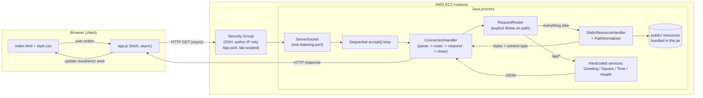

Component responsibilities, mapped to the metaphor:

| Component | File | Responsibility |
|---|---|---|
| Browser client | [`index.html`](src/main/resources/public/index.html), [`style.css`](src/main/resources/public/style.css) | The counter and the customer's own paperwork: page structure and layout. |
| Asynchronous client | [`app.js`](src/main/resources/public/app.js) | The request-slip system: fires `fetch()` calls, shows loading/result/error state, never reloads the page. |
| Server entry point | [`NetworkingServer`](src/main/java/edu/eci/arsw/networking/NetworkingServer.java) | Opens the one service window (`ServerSocket`) and runs the sequential accept loop. |
| Connection handler | [`ConnectionHandler`](src/main/java/edu/eci/arsw/networking/ConnectionHandler.java) | The clerk serving exactly one customer, start to finish, per connection. |
| Router | [`RequestRouter`](src/main/java/edu/eci/arsw/networking/RequestRouter.java) | The clerk's memorized list of special requests: explicit `if`/`else` on the path, no framework. |
| Static resources | [`StaticResourceHandler`](src/main/java/edu/eci/arsw/networking/StaticResourceHandler.java), [`PathNormalizer`](src/main/java/edu/eci/arsw/networking/util/PathNormalizer.java) | The under-the-counter drawer, plus the rule that no request slip can point outside it. |
| Hardcoded services | [`services/`](src/main/java/edu/eci/arsw/networking/services) | Greeting, Square, ServerTime, Health — each a small, independently testable class. |
| HTTP plumbing | [`http/`](src/main/java/edu/eci/arsw/networking/http) | Request parsing, response building, and writing bytes back to the socket. |

## 3. Design decisions

- **The server stays sequential on purpose.** `NetworkingServer` runs one `while` loop around
  `serverSocket.accept()`, and the next `accept()` only happens after `ConnectionHandler.handle()`
  returns. No `Thread`, `ExecutorService`, or thread pool appears anywhere in the request path.
  This is the lab's explicit teaching goal (Section 6.2): make the "one capacity limit" real and
  observable before addressing it.
- **Routes are intentionally hardcoded.** `RequestRouter` is a handful of `if` statements
  comparing `request.path()` against four literal strings. There is no reflection-based
  dispatcher, no annotation scanning, no dependency injection container — the lab explicitly asks
  for the path-to-behavior mechanism to stay visible.
- **Content types are selected by file extension**, via a fixed `Map<String,String>` in
  `ContentTypes`. Every resource — text or binary — is read into a `byte[]` and the
  `Content-Length` header is computed from `bytes.length`, never from `String#length()`, so
  multi-byte UTF-8 text and binary images both round-trip correctly.
- **Unsafe paths are rejected before any lookup happens.** `PathNormalizer` walks the requested
  path segment by segment and rejects the request the moment a `..` would go above the public
  root — it never constructs a path that could escape the resources area and hands it to the
  classloader. This runs for every static request, independent of how the resource is ultimately
  stored.
- **Static resources are bundled inside the jar** (`src/main/resources/public`, loaded through the
  classloader) rather than read from an external folder, so the whole application — page, script,
  images, and server — ships and deploys as **one artifact**: copy one `.jar` to EC2 and run it.
- **The browser client is asynchronous.** Every form submit and button click is handled with
  `event.preventDefault()` plus `fetch()`, so the page can show a loading state, keep the rest of
  the UI interactive, and distinguish a network failure from a valid HTTP error response — without
  ever implying that the *server* has become concurrent. Section 6.2 exists specifically to make
  that distinction observable.
- **Untrusted input is always escaped before it goes into a JSON body.** `JsonUtil.escape`/`quote`
  is the only place that builds a JSON string literal from user-supplied data (a name from the
  query string, an echoed invalid value), so a value containing `"`, `\`, or control characters
  can never terminate the string early or inject a sibling field.
- **No dependency beyond the JDK and JUnit.** The server, router, services, and JSON building use
  only `java.net`, `java.io`, and `java.util` — matching the lab's "no framework" spirit and
  keeping the deployable artifact self-contained.

## 4. Project structure

```
Networking/
├── pom.xml                          # Maven build descriptor (Java 17, JUnit 5)
├── .gitignore
├── README.md
├── deploy/
│   ├── networking-lab.service.template   # systemd unit template for EC2 (placeholders only)
│   └── run.sh                            # convenience local/EC2 run script
├── docs/                                 # evidence screenshots (see docs/README.md)
├── src/
│   ├── main/
│   │   ├── java/edu/eci/arsw/networking/
│   │   │   ├── NetworkingServer.java     # entry point: sequential accept() loop
│   │   │   ├── ConnectionHandler.java    # handles exactly one connection
│   │   │   ├── RequestRouter.java        # hardcoded path -> handler mapping
│   │   │   ├── StaticResourceHandler.java
│   │   │   ├── http/                     # HttpRequest/HttpResponse + parser/writer
│   │   │   ├── services/                 # Greeting, Square, ServerTime, Health, Slow
│   │   │   ├── util/                     # ContentTypes, PathNormalizer, JsonUtil
│   │   │   └── part1/                    # preliminary exercises, not graded here (Section 15)
│   │   └── resources/public/             # HTML, CSS, JS, images served by the server
│   └── test/
│       └── java/edu/eci/arsw/networking/ # JUnit 5 tests, mirroring the main package layout
```

Application code lives under `src/main/java`, public static resources under
`src/main/resources/public` (Maven's conventional resources directory, bundled into the jar), and
every test lives separately under `src/test/java`, mirroring the package it exercises. The
`part1/` package holds standalone exercises from the earlier networking guide (Section 15) and is
not part of the Part 2 application itself.

## 5. Prerequisites

- **Java 17** or later (JDK, not just a JRE — the build compiles from source).
- **Apache Maven 3.9+**.
- A modern browser (for local/manual testing of the asynchronous client).
- For the AWS section only: an approved AWS account/region and an SSH client, or the AWS Session
  Manager / EC2 Instance Connect plugin, per your course's approved connection method.

## 6. Installation and build

```bash
git clone <this-repository-url>
cd Networking
mvn test        # compiles and runs the full test suite
mvn package      # produces target/networking-lab-1.0.0.jar (skips nothing; runs tests first)
```

`mvn package` produces a single runnable jar at `target/networking-lab-1.0.0.jar` with the public
resources already bundled inside it — that jar is the entire deployable artifact.

## 7. How to run locally

```bash
java -jar target/networking-lab-1.0.0.jar
```

- **Port:** defaults to `35000`. Override it with either an environment variable or a system
  property:
  ```bash
  PORT=8080 java -jar target/networking-lab-1.0.0.jar
  # or
  java -Dport=8080 -jar target/networking-lab-1.0.0.jar
  ```
- **Browser address:** open `http://localhost:35000/` (or whatever port you chose).
- **Shutdown:** press `Ctrl+C` in the terminal running the server. A JVM shutdown hook closes the
  listening socket cleanly, which is the same mechanism a `systemctl stop` uses once the
  application runs as a managed service on EC2 (Section 7.4 of the lab).

`deploy/run.sh [port]` wraps the same command for convenience, locally or on the EC2 instance.

## 8. How to use the application

The home page (`/`) offers three actions, all handled asynchronously — the page never reloads:

| Action | Special URL | Required input | Success response | Invalid input |
|---|---|---|---|---|
| Get greeting | `GET /api/greeting?name=<value>` | Non-empty `name` | `200` JSON: `{"name": "...", "message": "Hello, ...!"}` | `400` JSON `{"error": "..."}` when `name` is missing or blank |
| Get square | `GET /api/square?value=<value>` | Numeric `value` | `200` JSON: `{"input": <n>, "square": <n²>}` | `400` JSON `{"error": "..."}` when `value` is missing, non-numeric, or infinite |
| Get server time | `GET /api/time` | none | `200` JSON: `{"serverTime": "<ISO-8601 offset date-time>"}` | — |
| Health check | `GET /api/health` | none | `200` JSON: `{"status": "UP"}` | — |

Only `GET` is accepted for every route; any other method returns `405 Method Not Allowed` with an
`Allow: GET` header. Requests for a static resource that does not exist return `404 Not Found`. A
request that tries to read outside the public resources area (a `..` traversal attempt, however it
is encoded) is rejected with `400 Bad Request` before any file lookup happens.

**One extra, non-required route: `GET /api/slow?seconds=<n>`.** This is not one of the four
services Section 4 asks for — it exists purely so Section 6.2's "open two browser windows"
experiment can be reproduced by clicking a button instead of contriving a slow request some other
way. It blocks the single server thread for `seconds` (0–30, defaults to 5) before returning
`{"sleptSeconds": <n>, "finishedAt": "<ISO-8601 offset date-time>"}`. See Section 9 for how to use
it to observe the sequential limitation.

## 9. How to run the tests

```bash
mvn test
```

The suite (80 tests, including `part1/EchoIntegrationTest`) covers three layers:

- **Unit tests** for the pieces that must be exactly right in isolation: `PathNormalizerTest`
  (traversal rejection), `ContentTypesTest` (extension → MIME mapping), `JsonUtilTest` (escaping,
  including an injection-attempt case), `HttpRequestParserTest` (request-line and query-string
  parsing), `HttpResponseWriterTest` (byte-accurate `Content-Length`, the `Allow` header on 405),
  and one test class per hardcoded service (`GreetingServiceTest`, `SquareServiceTest`,
  `ServerTimeServiceTest`, `HealthServiceTest`, `SlowServiceTest`).
- **Component tests** for `RequestRouter` and `StaticResourceHandler`, verifying the routing
  decisions and the static-file/traversal behavior without opening a socket.
- **End-to-end tests** in `NetworkingServerIntegrationTest`, which start the real server on an
  ephemeral port and drive it with real HTTP requests (`java.net.http.HttpClient`, and one raw
  `Socket` request to send an unnormalized `..` path byte-for-byte) — including ten consecutive
  requests against the same running process, matching the lab's functional test matrix
  (Section 6.1).

**Manual validation** (performed by the author before every deployment): load the home page in a
browser, confirm the network tab shows separate successful requests for the HTML, the script, and
both images with the expected content types; submit each form and confirm the result/error area
updates without a page reload.

**Observing Section 6.2 with two browser windows:**
1. Open the home page in two separate browser windows, side by side.
2. In the first window, use the "Slow service" card to trigger `GET /api/slow?seconds=8`.
3. Immediately, in the second window, request the greeting or the server time.
4. Watch the second window's request sit `(pending)` in the Network tab — it only resolves once
   the first window's slow request finishes, even though the second window's page stayed fully
   interactive the whole time. That gap is the sequential server; the interactive second window is
   the asynchronous client — two different properties, easy to conflate.

## 10. AWS deployment

The application was deployed to a single AWS EC2 instance, following the course-approved account,
region, Linux AMI, and instance size.

1. **Prepare the artifact locally:** `mvn package`, confirm `java -jar
   target/networking-lab-1.0.0.jar` serves the page and all four services locally.
2. **Launch the instance:** one Linux EC2 instance in the default VPC/public subnet, tagged with a
   descriptive lab name, connected to via the course-approved method (Session Manager, EC2
   Instance Connect, or SSH restricted to the author's own public IP).
3. **Security group:** inbound SSH (port 22) restricted to the author's IP only; one custom TCP
   inbound rule for the application port, scoped to the range the instructor allowed for
   classroom testing.
4. **Install the runtime:** installed a matching JDK (Java 17+) using the target AMI's package
   manager (e.g. `dnf install java-17-amazon-corretto` on Amazon Linux).
5. **Transfer the artifact:** copied `target/networking-lab-1.0.0.jar` (the single deployable
   artifact, resources included) to the instance via the approved connection method's file
   transfer (e.g. `scp`).
6. **Run as a managed service:** installed `deploy/networking-lab.service.template` as a systemd
   unit (placeholders replaced with the instance's real user, working directory, JDK path, and
   port — see the template's header for exact commands), so the process starts on boot, restarts
   on failure, logs to a known file, and stops cleanly with `systemctl stop`.
7. **Verify:** ran `curl http://localhost:<port>/api/health` from inside the instance first, then
   opened `http://<ec2-public-address>:<port>/` from a local browser to confirm the page, script,
   images, and all three dynamic services work through the public address.

No private key, AWS credential, instance ID, or public IP is stored in this repository. See
Section 11 for where the corresponding evidence is kept.

## 11. Evidence and results

Screenshots live under [`docs/`](docs/README.md), which also lists exactly what each one should
show and the lab section it backs up. Every image below is embedded directly from that folder, so
each one appears here as soon as the corresponding file is added — see `docs/README.md` for the
full checklist and capture tips.

**Local execution**

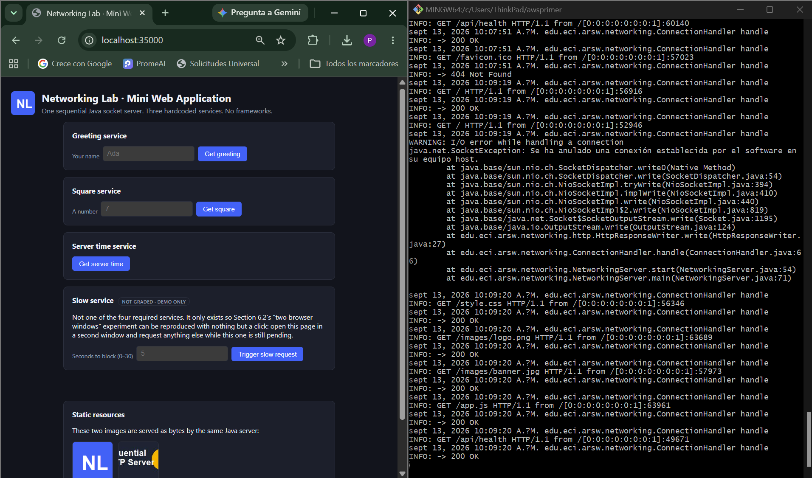
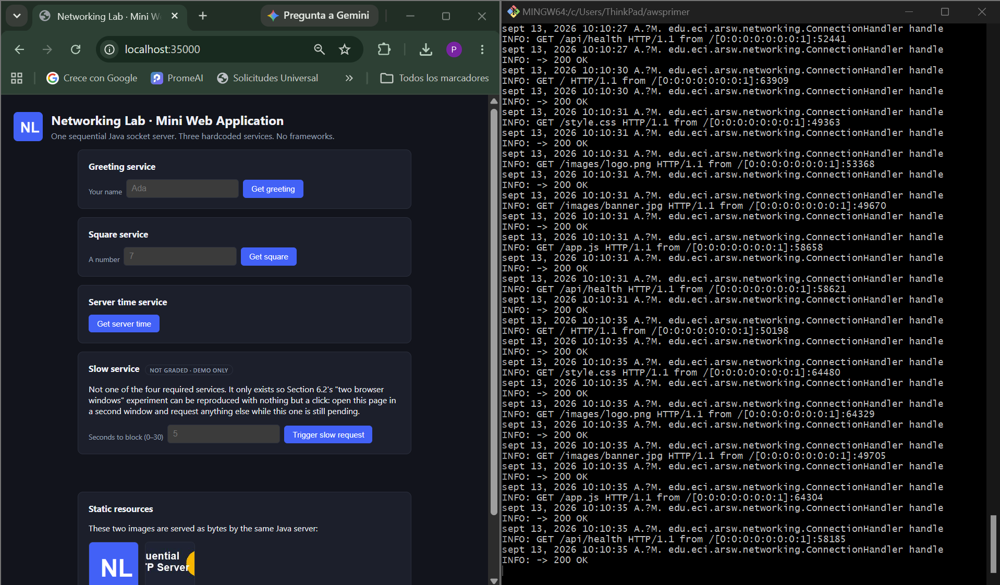

**Static resources and controlled errors**

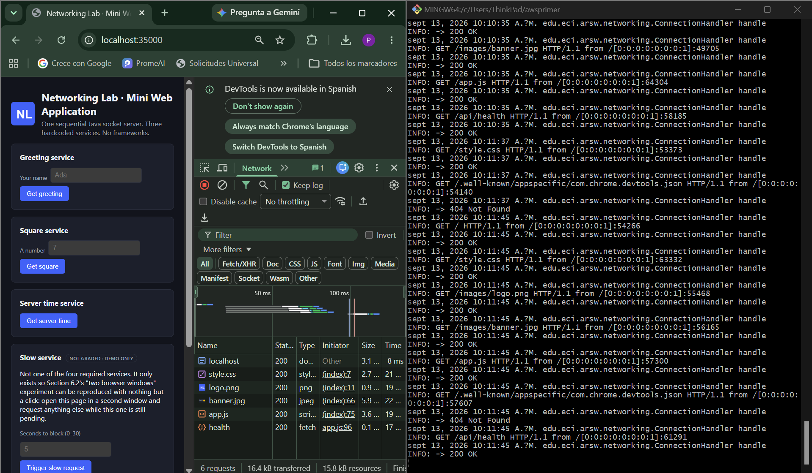
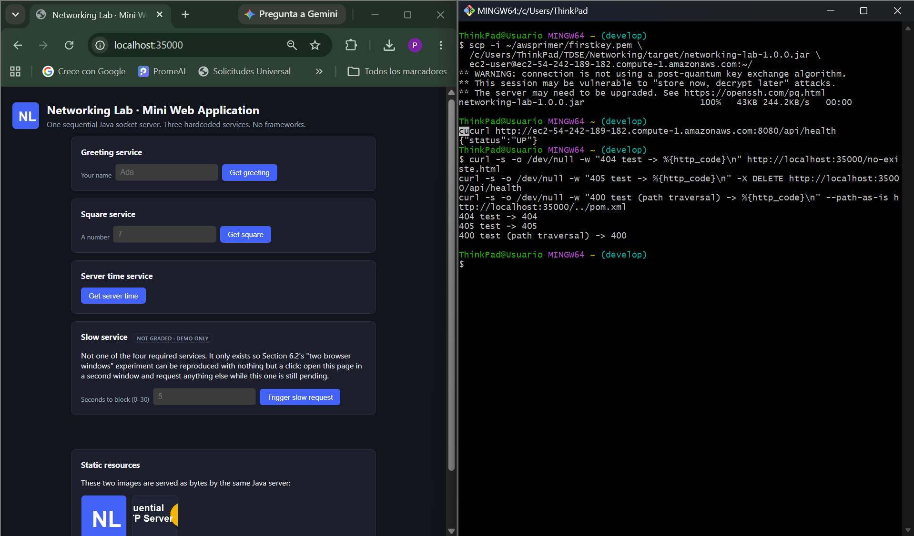

**Hardcoded services**

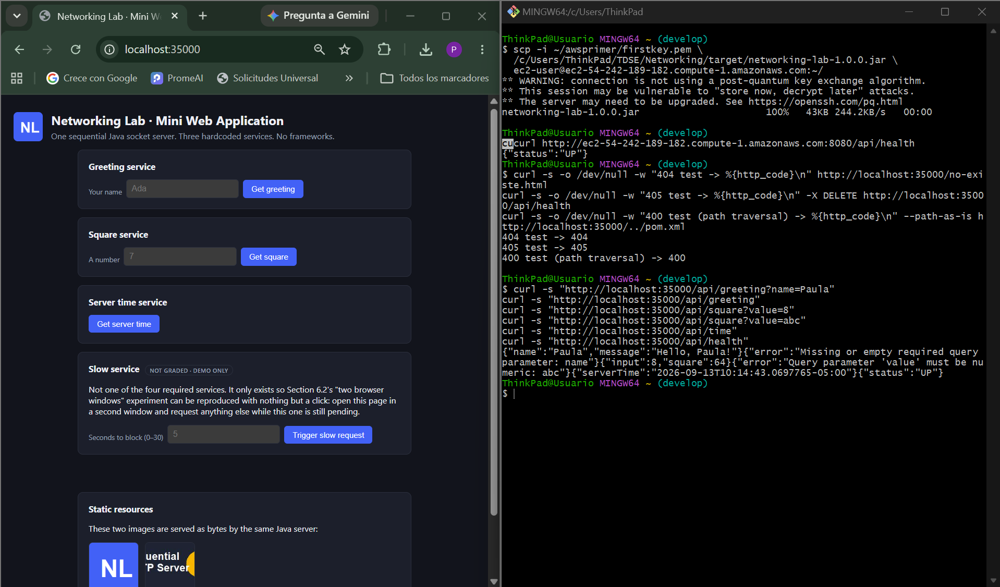

**Asynchronous client**

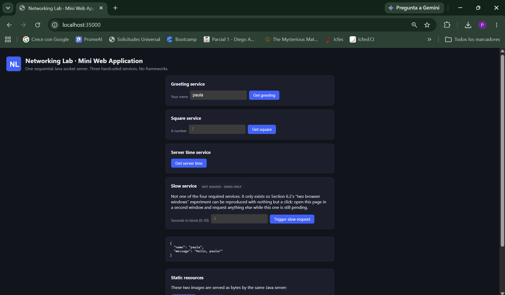
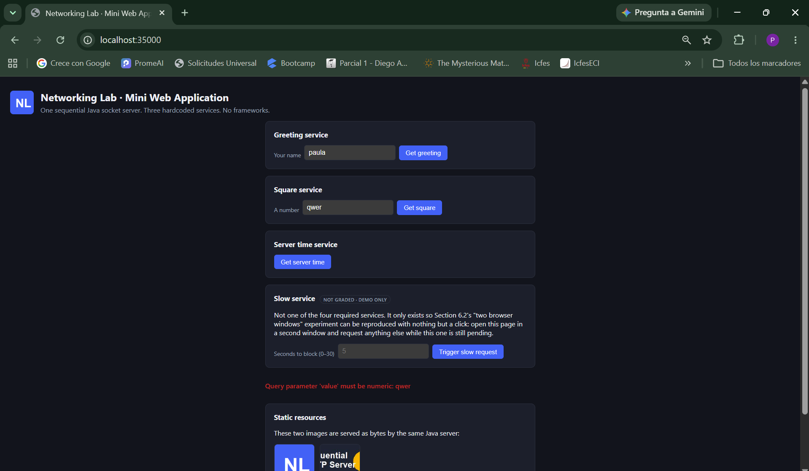

**Sequential limitation (Section 6.2)**

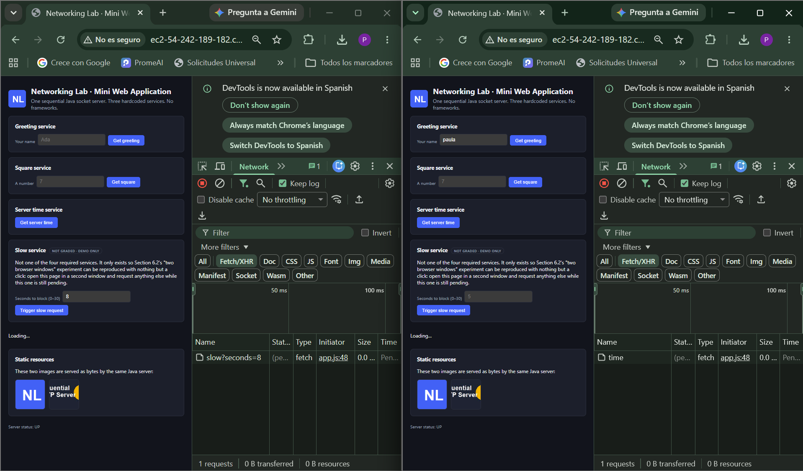

**AWS deployment**

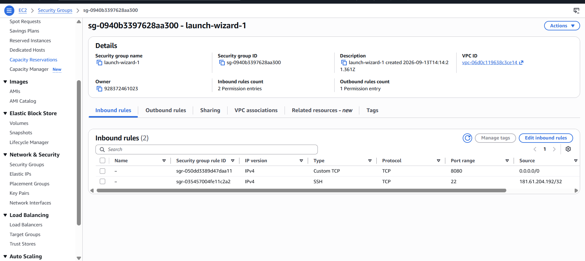
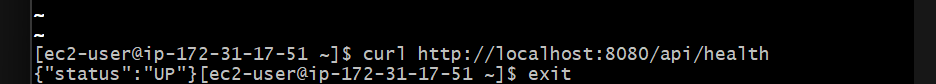
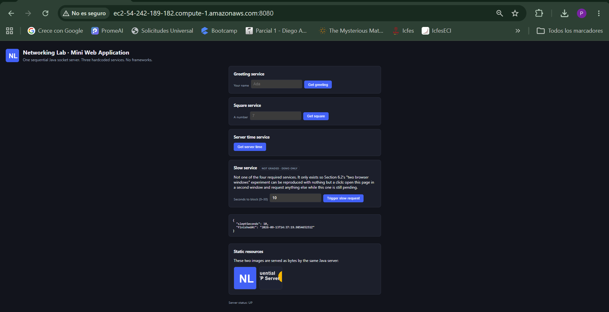
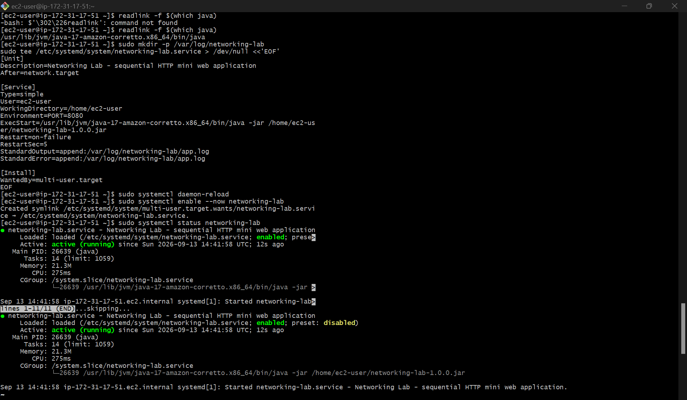
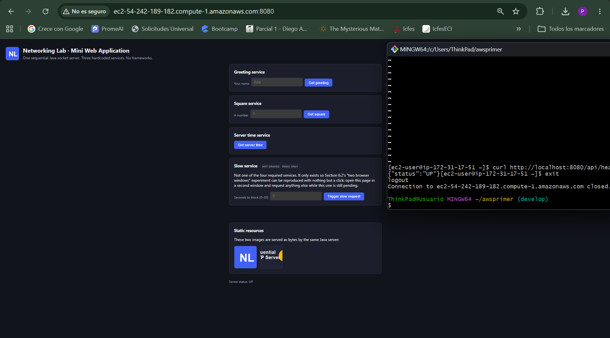

**AWS cleanup (Section 10)**

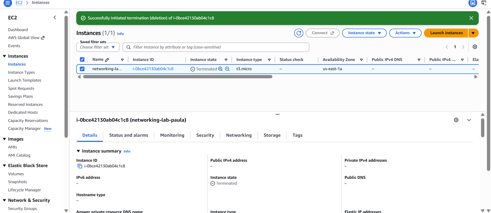

## 12. Known limitations

- The server is **strictly sequential**: it accepts and fully processes one TCP connection at a
  time. A slow request from one client delays every other client, by design (see Section 6.2 of
  the lab).
- Only the `GET` method is supported; every other method receives `405 Method Not Allowed`.
- Routing is a small, fixed set of hardcoded paths, not a general router — adding a new service
  means adding a new `if` branch in `RequestRouter`, on purpose.
- No authentication, encryption (no HTTPS), request body parsing, or persistence layer is
  implemented; the server does not store any information between requests.
- This is a teaching artifact, not a production-ready HTTP server: it has no protection against
  slow-client attacks, no configurable timeouts, and no request size limits.

## 13. Author and acknowledgment

**Author:** Paula Lozano ([lozano.paula1021@gmail.com](mailto:lozano.paula1021@gmail.com)).

This lab and its supporting material were assigned by Prof. Luis Daniel Benavides Navarro,
Escuela Colombiana de Ingeniería. Part of the introductory content referenced in the course
material is based on the official Java networking tutorials at
[docs.oracle.com/javase/tutorial/networking](https://docs.oracle.com/javase/tutorial/networking/index.html).
Implementation assistance was provided by Claude Code (Anthropic).

## 14. Discussion questions

1. **Why does a single HTML page cause several HTTP requests?** The HTML document only describes
   *references* to other resources (a `<script src>`, `` tags, later `fetch()` calls).
   The browser has to issue a separate request for each reference once it parses the document, so
   one page view becomes one request for the document plus one per script, image, and API call it
   needs.
2. **Why must image responses be treated as bytes rather than text?** Images are binary data;
   decoding or re-encoding them through a text charset (as `String`) can corrupt byte sequences
   that don't map cleanly to that charset. Reading and writing them as `byte[]` end-to-end is the
   only way to guarantee the bytes the browser receives are identical to the bytes on disk.
3. **What is the role of the response content type?** It tells the browser how to interpret the
   body: build a DOM from HTML, execute a script, decode and paint an image, or parse a JSON
   object. Serving the wrong content type causes the browser to mishandle an otherwise correct
   response (e.g. displaying JavaScript source as plain text instead of running it).
4. **What is hardcoded in this design, and what would a routing framework eventually
   generalize?** The mapping from a specific path (`/api/greeting`, `/api/square`, `/api/time`,
   `/api/health`) to a specific handler is hardcoded as explicit `if` statements in
   `RequestRouter`. A routing framework would generalize this into a table or annotation-driven
   dispatch mechanism (path patterns, parameter binding, middleware chains) so new routes could be
   added without touching a central dispatcher — at the cost of hiding the exact mechanism this
   lab wants visible.
5. **Why can the browser remain responsive while the server still handles requests
   sequentially?** Because responsiveness is a property of the *client's* event loop, not of the
   server. `fetch()` is asynchronous on the JavaScript side: it registers a callback and returns
   control to the browser immediately, so the user can keep interacting with the page while the
   response is still in flight — regardless of how long the server, elsewhere, takes to produce
   that response.
6. **What changed when the server moved to EC2? What did not change?** What changed: the network
   location (a public IP/DNS name instead of `localhost`), the operating environment (a remote
   Linux instance instead of a local machine), and the exposure surface (a security group now
   governs who can even reach the port). What did not change: the application code, its sequential
   accept loop, its hardcoded routes, and its single-instance capacity limit — moving host never
   made it concurrent or distributed.
7. **What happens when two users send slow requests at almost the same time?** The second user's
   request sits in the operating system's connection backlog until the server finishes handling
   the first user's request and calls `accept()` again. From the second user's perspective, the
   response is simply delayed by however long the first request took — the sequential server has
   no way to interleave the two.
8. **What is the next architectural limitation you would address — and why should concurrency
   come before load balancing?** The next limitation is the single-threaded accept loop itself:
   one slow or long-running request currently blocks every other client. Concurrency (a thread per
   connection, or a thread pool) has to come first because load balancing only distributes
   requests *across* multiple server instances — if each instance is still sequential internally,
   adding more of them just multiplies the same one-request-at-a-time bottleneck instead of fixing
   it.

## 15. Preliminary exercises from Part 1

Part 2 explicitly "begins after the minimal HTTP server from section 4.4" of the earlier
networking guide, so this repository also keeps the small standalone exercises that guide asked
for, under [`src/main/java/edu/eci/arsw/networking/part1`](src/main/java/edu/eci/arsw/networking/part1) —
kept separate from the graded Part 2 application, and not wired into `NetworkingServer` or
`RequestRouter` in any way.

| Class | Exercise | What it does |
|---|---|---|
| [`UrlComponentsPrinter`](src/main/java/edu/eci/arsw/networking/part1/UrlComponentsPrinter.java) | Section 3.1, Exercise 1 | Builds a `URL` and prints its protocol, authority, host, port, path, query, file, and ref |
| [`UrlPageDownloader`](src/main/java/edu/eci/arsw/networking/part1/UrlPageDownloader.java) | Section 3.2, Exercise 2 | Asks for a URL, reads the page it points to, and saves it as `result.html` |
| [`EchoServer`](src/main/java/edu/eci/arsw/networking/part1/EchoServer.java) | Section 4.2, Figure 4 | Accepts one connection and echoes back every line, prefixed with `Response: `, until it receives `Bye.` |
| [`EchoClient`](src/main/java/edu/eci/arsw/networking/part1/EchoClient.java) | Section 4.1, Figure 3 | Connects to `EchoServer`, sends each line typed on the keyboard, and prints the echoed response |

Run them individually after `mvn compile`:

```bash
java -cp target/classes edu.eci.arsw.networking.part1.UrlComponentsPrinter "http://ldbn.escuelaing.edu.co:80/index.html"
java -cp target/classes edu.eci.arsw.networking.part1.UrlPageDownloader
java -cp target/classes edu.eci.arsw.networking.part1.EchoServer 36000
java -cp target/classes edu.eci.arsw.networking.part1.EchoClient 127.0.0.1 36000
```

`EchoIntegrationTest` exercises the server/client pair over a real socket as part of `mvn test`;
`UrlComponentsPrinter` and `UrlPageDownloader` are interactive/console programs and are verified
manually.
